---
format:
  revealjs:
    theme: slides.scss
---

```{r}
#| include: false
source("_incremental_slides.R")
```

## {data-background-gradient="linear-gradient(135deg, #f8f9fa 0%, #e3f2fd 100%)"}

::: {style="text-align: left; padding: 1.5em 2em;"}
[**Getting Started with LLMs in R and Python**]{style="color: #0f5132; font-size: 2.3em; display: block; margin-bottom: 0.2em; font-weight: 700; letter-spacing: -0.02em; line-height: 1.1;"}

[Tools and Best Practices]{style="color: #0f5132; font-size: 1.3em; display: block; margin-bottom: 1em; font-weight: 400;"}

[**Sara Altman**]{style="color: #2c3e50; display: block; margin-bottom: 0.1em; font-size: 1.1em;"}
[Senior Developer Advocate, Posit]{style="color: #6c757d; display: block; margin-bottom: 0.6em;"}

[**PubHealth AI** | January 8, 2026]{style="color: #495057; display: block;"}
:::

## Today's agenda

1. Getting started with ellmer and chatlas
2. Adding knowledge with system prompts
3. Tool calling
4. AI tools for data analysis
5. Privacy & security

## Getting started 

Most LLMs are accessible through HTTP APIs

::: {.notes}
- LLMs are generally accessible through HTTP APIs
- Posit made it easy to interact with LLMs through these APIs
- Primary packages are ellmer for R and chatlas for Python
:::

## Getting started

Most LLMs are accessible through HTTP APIs

:::: {.columns}
::: {.column width="50%"}
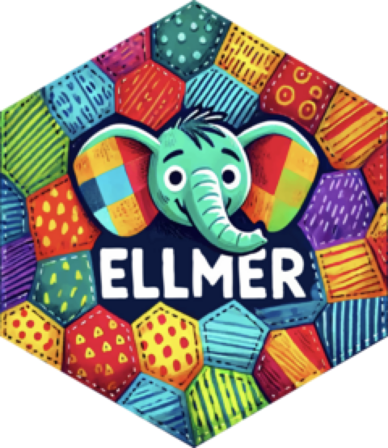{style="display: block; margin-left: auto; margin-right: auto; max-width: 400px;"}
:::
::: {.column width="50%"}
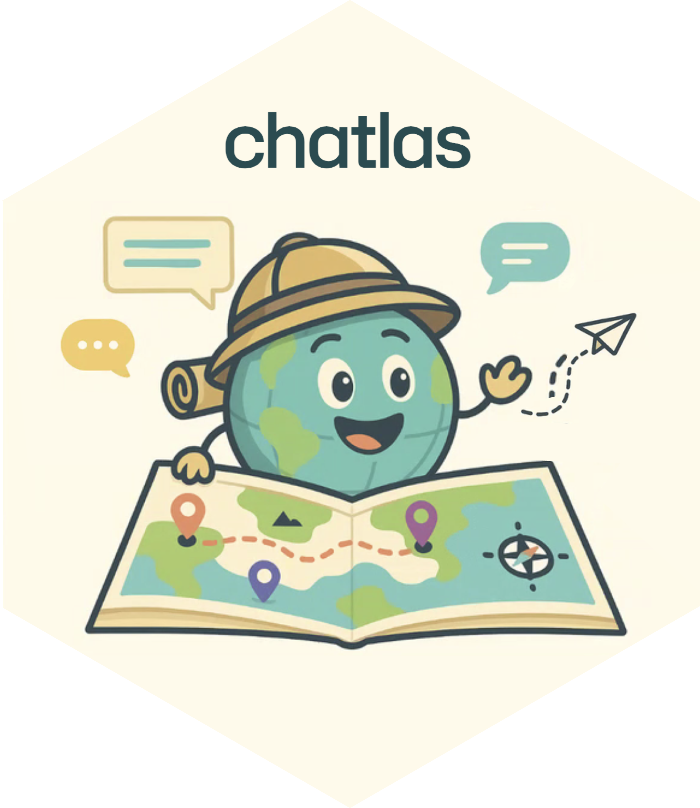{style="display: block; margin-left: auto; margin-right: auto; max-width: 400px;"}
:::
::::

::: {.notes}
- LLMs are generally accessible through HTTP APIs
- Posit made it easy to interact with LLM APIs
- ellmer for R, chatlas for Python
:::


## Three steps to get started

1. Acquire an API key (or other way to authenticate)

2. Add API key to `.Renviron` or `.env`

3. Install ellmer/chatlas: `install.packages("ellmer")` / `pip install chatlas`

::: {.notes}
- Three simple steps to get started with ellmer
- First acquire an API key from your chosen provider
- Store it securely in your .Renviron file
- Then install ellmer from CRAN
- That's all you need to start chatting with LLMs
:::


## Basic chat

```{.r filename="script.R" code-line-numbers="|1|3|4"}
library(ellmer)

chat <- chat("anthropic")
chat$chat("Summarize Picasso's style in 5 words")
```

::: {.notes}
- Hello world of ellmer
- Load the package, create a chat object, call the chat method
:::

## Basic chat

```{.python filename="script.py" code-line-numbers="|1|3|4"}
import chatlas as ctl

chat = ctl.ChatAnthropic()
chat.chat("Summarize Picasso's style in 5 words")
```

::: {.notes}
- Same pattern in Python with chatlas
- Use provider-specific classes like ChatAnthropic()
:::

## Basic chat

```{.r filename="script.R"}
library(ellmer)

chat <- chat("anthropic")
chat$chat("Summarize Picasso's style in 5 words")
```

*"Cubist, abstract, fragmented, revolutionary, expressive."*

## Basic chat

```{.python filename="script.py"}
import chatlas as ctl

chat = ctl.ChatAnthropic()
chat.chat("Summarize Picasso's style in 5 words")
```

*"Cubist, abstract, fragmented, revolutionary, expressive."*

## Basic chat

Continue the conversation:

```{.r filename="script.R"}
chat$chat("Now Georgia O'Keeffe")
```

## Basic chat

Continue the conversation:

```{.python filename="script.py"}
chat.chat("Now Georgia O'Keeffe")
```

## Basic chat

Continue the conversation:

```{.r filename="script.R"}
chat$chat("Now Georgia O'Keeffe")
```

*"Organic, magnified, minimalist, nature-focused, colorful."*

::: {.notes}
- Each subsequent call continues the conversation
- The chat object maintains history
- APIs are nearly identical between R and Python
:::

## Basic chat

Continue the conversation:

```{.python filename="script.py"}
chat.chat("Now Georgia O'Keeffe")
```

*"Organic, magnified, minimalist, nature-focused, colorful."*

::: {.notes}
- Each subsequent call continues the conversation
- The chat object maintains history
- APIs are nearly identical between R and Python
:::

## Switching providers or models

```{.r filename="script.R"}
chat <- chat("google_gemini")

chat <- chat("openai/gpt-5")

chat <- chat("aws_bedrock")
```

::: {.notes}
- Both ellmer and chatlas make it easy to switch providers
- R uses chat() with provider string, Python uses provider-specific classes
- Can specify models inline
- Same patterns - easy to work in either language
:::

## Switching providers or models

```{.python filename="script.py"}
chat = ctl.ChatGoogle()

chat = ctl.ChatOpenAI(model="gpt-5")

chat = ctl.ChatBedrock()
```

::: {.notes}
- Both ellmer and chatlas make it easy to switch providers
- R uses chat() with provider string, Python uses provider-specific classes
- Can specify models inline
- Same patterns - easy to work in either language
:::

## Getting started 

_What we normally advise. It may not apply to you!_

::: {.incremental}
* Start with the best models (Claude Sonnet 4.5, GPT-5, etc.)
  * Not with local models
* Get a good grasp of how the APIs work first, and then think about security and data privacy
  * Don't start with non-public information or data
:::

::: {.notes}
Don't use open weights models
:::

# [Adding knowledge]{.ph5 .pv3 style="background-color: rgba(255, 255, 255);"} {.no-invert-dark-mode background-image="images/anna-mould-Zck1ap7muew-unsplash.jpg" background-size="cover" background-position="center" style="display: flex !important; flex-direction: column !important; justify-content: flex-start !important;"}

::: footer
Photo by <a href="https://unsplash.com/@phosphoricc?utm_source=unsplash&utm_medium=referral&utm_content=creditCopyText">Anna Mould</a> on <a href="https://unsplash.com/photos/a-book-shelf-filled-with-lots-of-books-Zck1ap7muew?utm_source=unsplash&utm_medium=referral&utm_content=creditCopyText">Unsplash</a>
:::

::: {.notes}
- Now let's move beyond basic chat
- We want to teach the model things it doesn't know
- Give it context about our specific domain or data
:::

## Adding knowledge

::: {.fragment}
**Start with** system prompt customization
:::

::: {.fragment}
Not fine-tuning or RAG
:::

::: {.notes}
- Tell the models something that they don't know
- Start with system prompt customization. Easy, effective, fast
- What's a system prompt? It's instructions from you to the model that set its behavior
- The system prompt shapes EVERY response the model gives
- You can put instructions and background knowledge in the system prompt
- This is really powerful - you can exert quite a bit of control over how the model behaves

- Don't start with RAG. Very useful, just not the one you should be starting with
- Same thing with fine tuning

- Other techniques take a bit of finessing

:::


## System prompts

```{.r filename="script.R"}
chat <- chat(
  "anthropic",
  system_prompt =
    "You are a data analyst assistant
    who answers as briefly as possible."
)
```

::: {.notes}
- System prompts customize how the model behaves
- Set the system_prompt argument when creating a chat
- Here we're telling it to be a data analyst who answers briefly
- System prompts persist across the entire conversation
- Same pattern in both R and Python
:::

## System prompts

```{.python filename="script.py"}
chat = ctl.ChatAnthropic(
    system_prompt="""
    You are a data analyst assistant
    who answers as briefly as possible.
    """
)
```

::: {.notes}
- System prompts customize how the model behaves
- Set the system_prompt argument when creating a chat
- Here we're telling it to be a data analyst who answers briefly
- System prompts persist across the entire conversation
- Same pattern in both R and Python
:::

## Store prompts in markdown files

::: {style="--code-font-size: 0.75em"}
```{.r filename="script.R" code-line-numbers="|2-4|8"}
system_prompt <- paste(
  "You answer questions about our trial protocol:",
  readr::read_file("protocol-excerpt.md"),
  collapse = "\n"
)

chat <-
  chat("anthropic", system_prompt = system_prompt)
```
:::

::: notes
Here's a real example. We create a system prompt that includes the clinical trial protocol document, plus instructions to cite section numbers.

Then we create a chat with this system prompt. Now the LLM has knowledge of our specific trial that it didn't have before!
:::

<!-- ## Store prompts in markdown files

::: {style="font-size: 0.55em"}
```markdown
...
### 4.2 Exclusion Criteria

Participants meeting ANY of the
following criteria will be excluded:

1. Diagnosis of Type 1 diabetes mellitus or history of diabetic ketoacidosis
2. History of pancreatitis or pancreatic surgery
3. Severe renal impairment (eGFR <30 mL/min/1.73m²)
4. Active liver disease or ALT/AST >3x upper limit of normal
...
```
:::

-->

##

::: {style="--code-font-size: 0.6em"}
```{.r filename="script.R"}
chat$chat("Can we enroll a 76-year-old patient with HbA1c of 9.5%?")
```
:::

<br>

::: {.fragment style="font-size: 0.7em"}
```{.markdown code-line-numbers="false" style="border: none !important; box-shadow: none !important;"}
No, this patient cannot be enrolled.

According to Section 4.1 (Inclusion Criteria), criterion #1 states
that participants must be "aged 18 to 75 years (inclusive)."
At 76 years old, this patient exceeds the upper age limit.

However, their HbA1c of 9.5% does meet the study requirement.
Criterion #3 specifies HbA1c must be "between 7.0% and 10.5%
(inclusive) at screening."

The patient would need to meet ALL inclusion criteria to be eligible.
```
:::

::: {.notes}
- Here's the model using the protocol we gave it
- It correctly identifies the patient is too old
- Cites the specific section and criterion
- Also helpfully notes that the HbA1c would have been fine
- This shows how system prompts give LLMs domain knowledge
:::

## Tips and tricks

::: incremental
* Clearly explain what you want the model to do in the system prompt

* Provide examples of what you want

* Use markdown headings and XML tags to structure prompts

* Use LLMs to help draft your prompts
:::

::: {.notes}
- Be explicit about what you want the model to do
- Examples are incredibly powerful - show the model what good output looks like
- Structure matters - use headings and XML tags to organize complex prompts
- Claude has a prompt generator that's excellent for this
- These tips will solve most issues you encounter with model behavior
:::


# [Tool calling]{.ph5 .pv3 style="background-color: rgba(255, 255, 255);"} {.no-invert-dark-mode background-image="images/elena-mozhvilo-RhXAO8OXyDY-unsplash.jpg" background-size="cover" background-position="center"}

::: footer
Photo by <a href="https://unsplash.com/@miracleday?utm_source=unsplash&utm_medium=referral&utm_content=creditCopyText">Elena Mozhvilo</a> on <a href="https://unsplash.com/photos/black-and-silver-hand-tool-set-RhXAO8OXyDY?utm_source=unsplash&utm_medium=referral&utm_content=creditCopyText">Unsplash</a>
:::

::: {.notes}
- Now we'll talk about tools
- This is how we give LLMs the ability to take action
- And access real-time information
:::

## How do LLMs actually work?

::: fragment
_On their own, can LLMs... access the internet? run code? send an email? interact with the world?_
:::

::: {.notes}
- Before we dive into tools, let's clarify what LLMs can and can't do
- On their own, LLMs are quite limited
- They can't access the internet, run code, or interact with systems
- They only process the text you send them
- This is where tools come in
:::


## <span style="color: white;">LLMs don't have access to real-time data</span>

::: notes
This one also fails - the model can't access real-time weather data. No internet connection.
:::

::: {style="--code-font-size: 0.78em"}
```{.r filename="script.R"}
chat <- chat("anthropic")

chat$chat("What's the weather like in Seattle?")
```
:::

<br>

::: fragment
```{.markdown code-line-numbers="false" style="border: none !important; box-shadow: none !important;"}
I don't have access to real-time weather data, so
I can't tell you the current weather conditions
in Seattle, Washington.
```
:::

## LLMs don't have access to real-time data

::: {style="--code-font-size: 0.78em"}
```{.r filename="script.R"}
chat <- chat("anthropic")

chat$chat("What's the weather like in Seattle?")
```
:::

<br>

```{.markdown code-line-numbers="false" style="border: none !important; box-shadow: none !important;"}
I don't have access to real-time weather data, so
I can't tell you the current weather conditions
in Seattle, Washington.
```

::: notes
- The model can't access real-time weather data
- No internet connection - it only knows what was in its training data
:::

## <span style="color: white;">Or the ability to affect the world</span>

::: {style="--code-font-size: 0.9em"}
```{.r filename="script.R"}
chat <- chat("anthropic")

chat$chat("write df to data/data.csv")
```
:::

<br>

::: fragment
```{.markdown code-line-numbers="false" style="border: none !important; box-shadow: none !important;"}
I'm not able to actually create or write files on
your computer - I can only provide code and text
responses. As an AI assistant, I don't have the
ability to execute code or interact with file
systems directly.
```
:::

## Or the ability to affect the world

::: notes
so they don't have the ability to access up to date information...
or the ability to affect the world
:::

::: {style="--code-font-size: 0.9em"}
```{.r filename="script.R"}
chat <- chat("anthropic")

chat$chat("write df to data/data.csv")
```
:::

<br>

```{.markdown code-line-numbers="false" style="border: none !important; box-shadow: none !important;"}
I'm not able to actually create or write files on
your computer - I can only provide code and text
responses. As an AI assistant, I don't have the
ability to execute code or interact with file
systems directly.
```

## Tool = function + metadata {.center}

::: incremental
* Bring real-time or up-to-date information to the model

* Let the model interact with the world
:::

::: notes
So how do we solve these problems? Tools! Also called functions or function calling.

Tools are extra capabilities that you give to the LLM, like the ability to check the weather or query a database.
These capabilities are things that the model can't do on its own.
The goal is to let the model pull in real-time or up-to-date information as needed.

They can also give the model new abilities to take action on behalf of the user.
:::

## Tool = function + metadata

```{.r filename="script.R" code-line-numbers="|1|1-2|3-4|5-8|11"}
get_weather <- tool(
  \(lat, lon) weathR::point_forecast(lat, lon),
  name = "get_weather",
  description = "Get the weather for a location.",
  arguments = list(
    lat = type_number("Latitude"),
    lon = type_number("Longitude")
  )
)

chat$register_tool(get_weather)
```

::: {.notes}
- Here's how to create a tool in ellmer and chatlas
- R: Wrap function with tool() and provide metadata explicitly
- Python: Use type hints and docstrings - metadata is inferred!
- Both: Register the tool with your chat object
- LLM now knows this tool exists and can request to use it
:::

## Now the model can tell us the weather

::: {style="--code-font-size: 0.75em"}
```{.r filename="script.R"}
chat$chat("What's the weather in Seattle?")
```
:::

<br>

::: {.fragment style="font-size: 0.75em"}
```{.markdown code-line-numbers="false" style="border: none !important; box-shadow: none !important;" code-line-numbers="1|2|3-10"}
◯ [tool call] get_weather(lat = 47.6062, lon = -122.3321)
● #> [{"time":"2026-01-07 16:00:00 PST","temp":42,"dewpoint":3.8889,"humidity":88,"p_r…
Here's the current weather for Seattle:

**Current Conditions (4:00 PM PST):**
- **Temperature:** 42°F
- **Conditions:** Chance of rain and snow showers
- **Humidity:** 88%
- **Wind:** SSW at 10 mph
- **Chance of precipitation:** 44%
```
:::


::: notes
- Now when we ask about the weather, the LLM calls our tool
- It figured out the lat/lon for Seattle on its own
- The tool returns real data, and the model formats it nicely
- This is the power of tools - real-time information the model couldn't access before
:::

## The LLM can't run code by itself!

It just requests that tools be run. 

<br>

::: fragment
The LLM controls:

::: incremental
1. **When** the tool is called
2. **How** the tool is called
:::
:::

::: notes
- This is a crucial concept to understand
- The LLM doesn't execute anything
- It just requests that you run the tool
- You have control over whether to execute it
- The LLM decides when to call a tool and what arguments to use
- But your code actually runs the function
- This keeps you in control of what happens
:::

## Tool calling with chatlas

Tool calling in Python works similarly. Read about it here:

<https://posit-dev.github.io/chatlas/tool-calling/how-it-works.html>

# {.title-push-down .no-invert-dark-mode background-image="images/yoonjae-baik-p7MsAMLSbbU-unsplash.jpg" background-size="cover" background-position="center"}

::: footer
Photo by <a href="https://unsplash.com/@houston100?utm_source=unsplash&utm_medium=referral&utm_content=creditCopyText">YoonJae Baik</a> on <a href="https://unsplash.com/photos/white-short-coated-small-dog-on-brown-wooden-floor-p7MsAMLSbbU?utm_source=unsplash&utm_medium=referral&utm_content=creditCopyText">Unsplash</a>
:::

::: notes
you might feel apprehensive like this cat, but also curious
you've heard they can do cool things, but also that they hallucinate, etc
:::

# [What are LLMs good for?]{.ph5 .pv3 style="background-color: rgba(255, 255, 255);"} {.no-invert-dark-mode background-image="images/yoonjae-baik-p7MsAMLSbbU-unsplash.jpg" background-size="cover" background-position="center"}

::: footer
Photo by <a href="https://unsplash.com/@houston100?utm_source=unsplash&utm_medium=referral&utm_content=creditCopyText">YoonJae Baik</a> on <a href="https://unsplash.com/photos/white-short-coated-small-dog-on-brown-wooden-floor-p7MsAMLSbbU?utm_source=unsplash&utm_medium=referral&utm_content=creditCopyText">Unsplash</a>
:::

::: {.notes}
- Now that you know how to use LLMs, let's talk about when to use them
- What are they actually good at?
- And what should you avoid?
:::

# LLMs are jagged

::: {.notes}
- LLM performance is unpredictable
- They don't follow smooth capability curves
- Can excel at complex tasks but fail at simple ones
:::

## {.center}

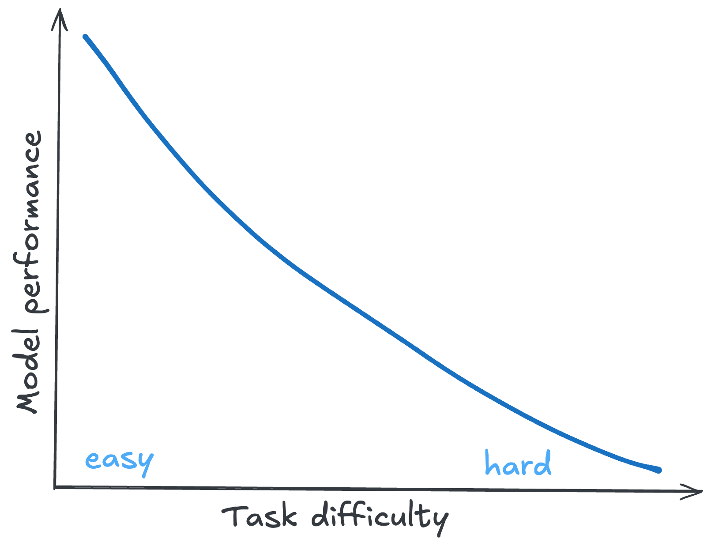{style="max-width: 90%; max-height: 700px; display: block; margin-left: auto; margin-right: auto;"}

::: {.notes}
- You might expect model performance looks like this
- Smooth curve from easy to hard tasks
- Better models consistently better at everything
- But that's not reality
:::

## {.center}

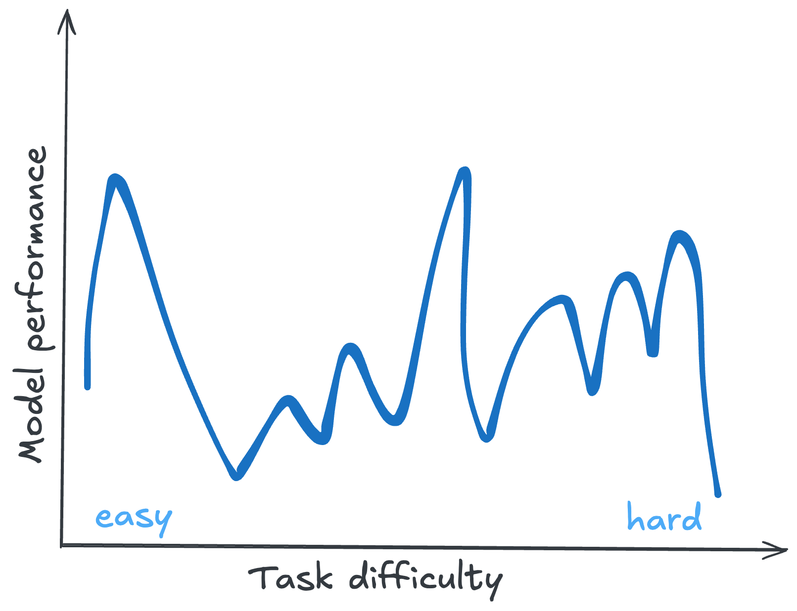{style="max-width: 90%; max-height: 700px; display: block; margin-left: auto; margin-right: auto;"}

::: {.notes}
- LLMs aren't bad
- They are just jagged
- Might expect it's like this [shows line]
- But actually like this [shows jagged line]
- They are really good at coding. And coding is pretty hard
- But simple data tasks they are often bad at
:::

## Think empirically, not theoretically {.center .text-center}


::: {.incremental}
- It's okay to (mostly) treat LLMs as **black boxes**.

- **Just try it!** When wondering if an LLM can do something,\
  experiment rather than theorize

- You might think they could not possibly do things\
  _that they clearly can do today_

- And you might think _surely_ they can do something\
  that it turns out they're _terrible_ at
:::

::: {.notes}
- The key insight: treat LLMs as black boxes
- Don't theorize about what they can or can't do
- Just try it and see what happens
- You'll be surprised both ways
- Things you think are impossible might work
- Things you think are easy might fail
- Experimentation beats intuition
:::

##

:::: {.columns}
::: {.column width="50%"}
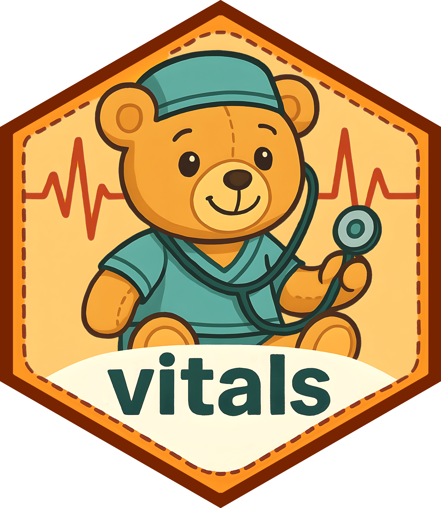{style="display: block; margin-left: auto; margin-right: auto; max-width: 400px;"}
:::
::: {.column width="50%"}
{style="display: block; margin-left: auto; margin-right: auto; max-width: 400px;"}
:::
::::

::: footer
[vitals.tidyverse.org](vitals.tidyverse.org) | [posit-dev.github.io/chatlas/misc/evals.html](https://posit-dev.github.io/chatlas/misc/evals.html)
:::

::: {.notes}
vitals package for R, chatlas has eval support for Python
run llm evals from r or python
compare models, compare prompts
make sure your tools are working as you want
:::

##

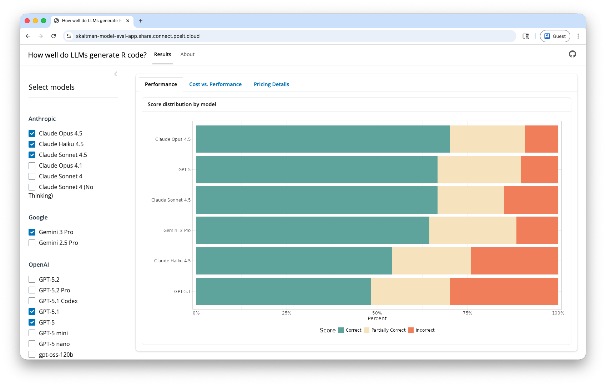

::: footer
[https://skaltman-model-eval-app.share.connect.posit.cloud/](https://skaltman-model-eval-app.share.connect.posit.cloud/)
:::

::: {.notes}
- This is from the vitals package
- It helps you evaluate LLM performance systematically
- Don't just guess if a model is good enough
- Test it on your actual use case
:::

# AI tools for _doing_ data analysis

::: {.notes}
- Beyond packages, Posit has built AI-powered tools for data science
- These combine LLMs with the ability to execute code
:::

## Positron Assistant

::: {.incremental}
* AI coding assistant built specifically for data science workflows

* Generate code, refactor, debug, answer questions
:::

::: {.notes}
- Positron is Posit's next-gen IDE
- Assistant is built right in
- It can see your code, your data, your environment
- Very powerful for day-to-day coding tasks
:::

## Databot

:::: {.columns}
::: {.column width="50%"}
::: {.incremental}
* AI agent for **exploratory data analysis**

* Do in minutes what might take hours

* Designed for tight feedback loops

* Available in Positron
:::
:::

::: {.column width="50%"}
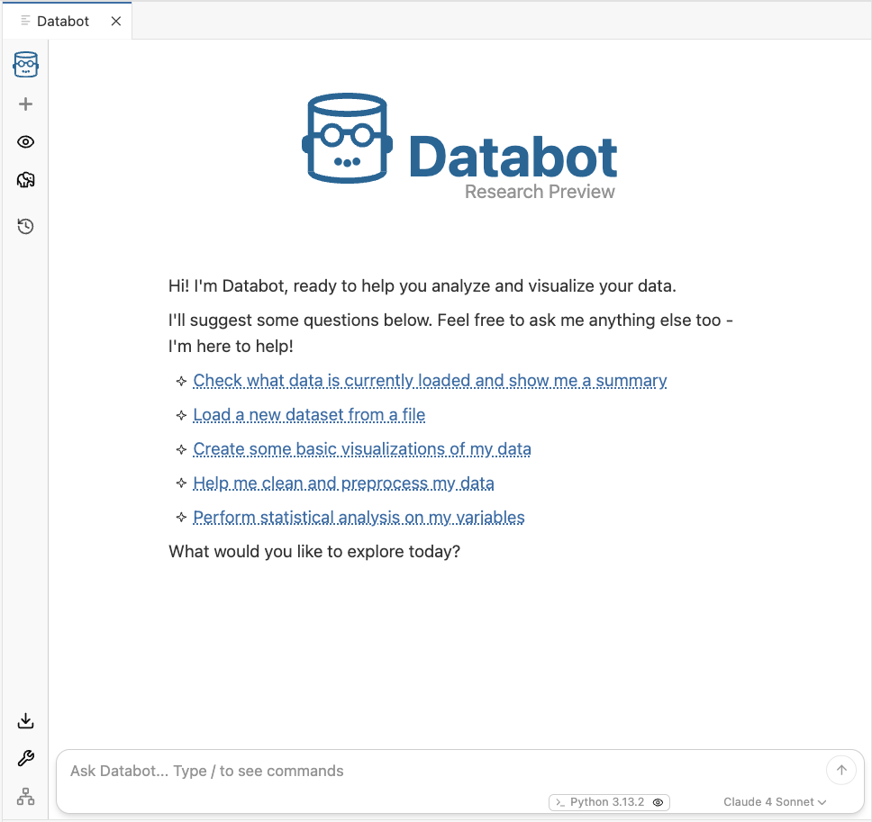{style="max-width: 100%;"}
:::
::::

::: footer
[positron.posit.co/databot.html](https://positron.posit.co/databot.html)
:::

::: {.notes}
- Databot is specifically for EDA
- It can explore and visualize your data
- Designed so you can catch mistakes
- Not meant to replace your judgment, but to accelerate your workflow
:::

## Are these tools (and ones like it) safe? 

::: {.incremental}
* Positron Assistant and Databot can execute arbitrary code and see your files

* They incorporate this information into queries sent to the LLM

* This raises important questions about privacy
:::

::: {.notes}
- This is the key point to transition to privacy
- These tools are powerful because they can see and work with your data
- But that means your data is going somewhere
- Let's talk about where
:::

# [Privacy & Security]{.ph5 .pv3 style="background-color: rgba(255, 255, 255);"} {.no-invert-dark-mode background-image="images/trust-fence.jpg" background-size="cover" background-position="center"}

::: {.notes}
- Before we move on, important to discuss privacy and security
- Especially relevant for those working with protected health data
:::

## Model providers vs. LLMs

::: {.incremental}
* **Provider:** The company that hosts the model (Anthropic, OpenAI, Google, Hugging Face, etc.).

* **LLM:** The actual model that generates responses to your queries.

* LLMs are **stateless.** They have no memory of your prior requests.

* However, the model provider may **log and store** your requests and use them for other purposes.
::: 

::: {.notes}
- The model doesn't remember you, but the provider's servers might
:::

## Where does your data go?

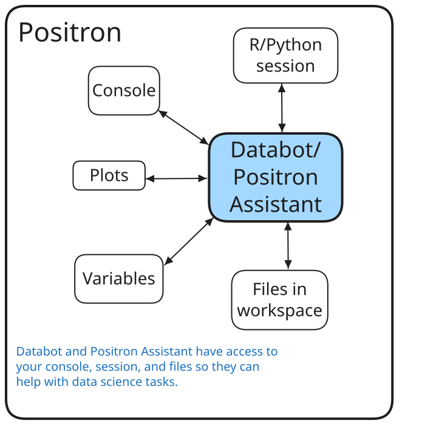{style="display: block; margin-left: auto; margin-right: auto; max-width: 90%;"}

::: {.notes}
- Start with Positron - your local environment with your data
:::

## Where does your data go?

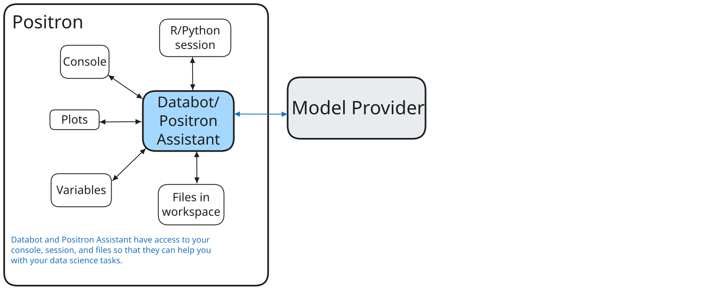{style="display: block; margin-left: auto; margin-right: auto; max-width: 90%;"}

::: {.notes}
- Data flows to the model provider when you make a request
:::

## Where does your data go?

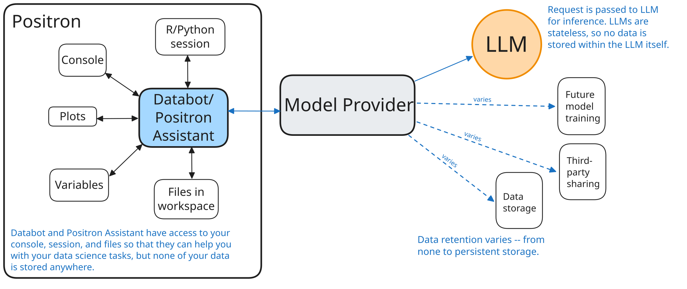{style="display: block; margin-left: auto; margin-right: auto; max-width: 90%;"}

::: {.notes}
- Posit doesn't store your data - it passes through to the provider
:::

## You need to trust your model provider

* **Posit doesn't store your data**

* But your provider might, depending on your agreement

::: {.notes}
- You pay the provider directly
- Posit's tools don't collect conversation histories
:::

## The good news

::: incremental

::: fragment
Your organization can work out a zero data retention (ZDR), HIPAA-compliant agreement, or other arrangements with model providers. These arrangements are common. 
:::

::: fragment

**Learn more:** <https://posit.co/blog/trust-llm-tools/>
:::
:::

## Learn More

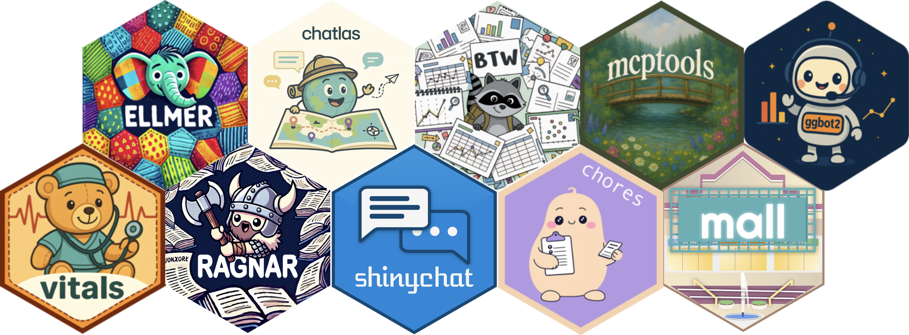{style="display: block; margin-left: auto; margin-right: auto; max-width: 90%;"}

::: {.notes}
- These are the main packages we've covered today
- ellmer for R chat, chatlas for Python chat
- shinychat for building interfaces
- querychat for database interactions
- vitals for evaluation
:::

## Learn More

* ellmer (R): [ellmer.tidyverse.org](ellmer.tidyverse.org)

* chatlas (Python): [posit-dev.github.io/chatlas](posit-dev.github.io/chatlas)

* shinychat: [posit-dev.github.io/shinychat](posit-dev.github.io/shinychat)

* querychat: [https://github.com/posit-dev/querychat](https://github.com/posit-dev/querychat)

* vitals: [vitals.tidyverse.org](vitals.tidyverse.org)

::: {.notes}
- Here are the documentation sites for each package
- ellmer for R, chatlas for Python - same patterns, different languages
- Great starting points for deeper exploration
:::

## Learn More

::: columns

::: column
**Posit AI Newsletter**: <https://posit.co/blog/?post_tag=ai-newsletter>


:::

::: column
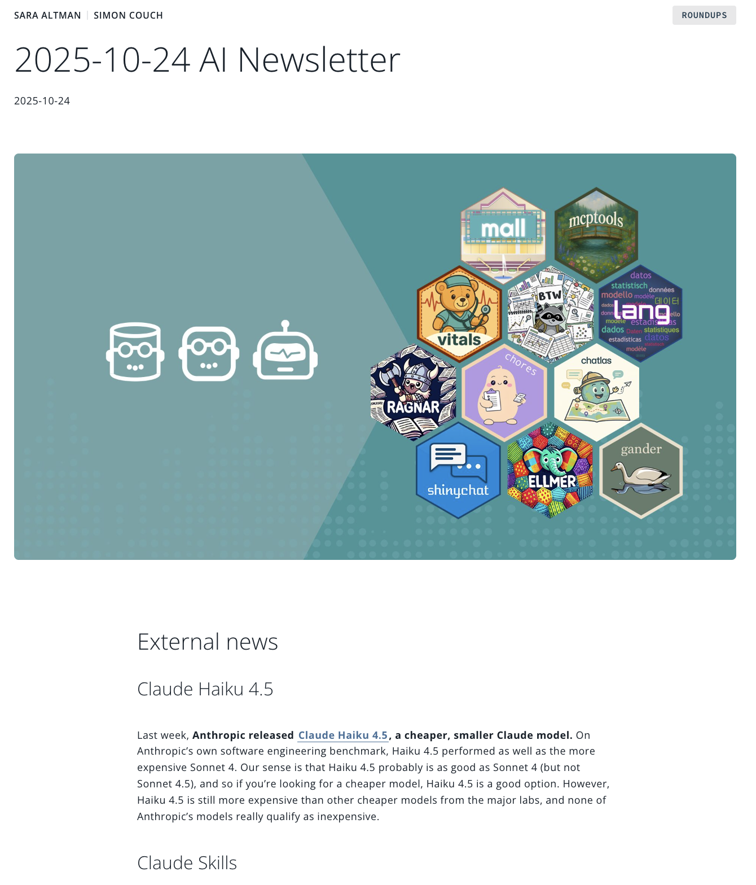
:::

:::

::: {.notes}
- We publish an AI newsletter regularly
- Covers new developments, tutorials, best practices
- Scan the QR code or visit the link to subscribe
:::

# Thank you!


[{height="40px" style="vertical-align: middle;"}](https://github.com/skaltman/pubhealth-ai-2026) <https://github.com/skaltman/pubhealth-ai-2026>

[{height="40px" style="vertical-align: middle;"}](https://www.linkedin.com/in/sarakaltman/) [linkedin.com/in/sarakaltman/](https://www.linkedin.com/in/sarakaltman/)

[{height="40px" style="vertical-align: middle;"}](https://bsky.app/profile/sara-altman.bsky.social) [sara-altman.bsky.social](https://bsky.app/profile/sara-altman.bsky.social)

::: {.notes}
- Thank you for attending
- The GitHub repo has all the code and slides
- Feel free to experiment and reach out with questions
:::

